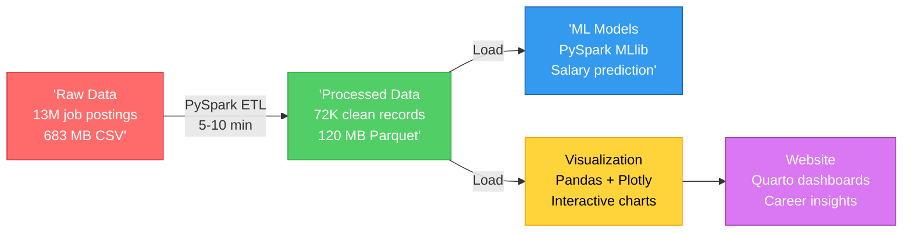
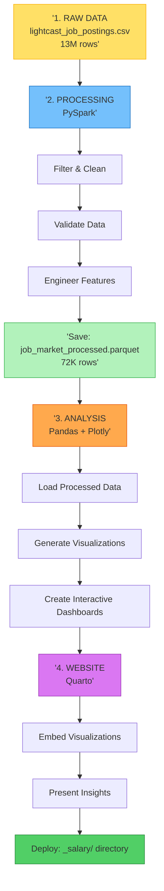

# System Architecture

## Tech Career Intelligence Platform

> This document provides a simplified overview of how the system works. For detailed implementation, see [DESIGN.md](DESIGN.md)

---

## What Does This System Do?

Analyzes **72,000+ tech job postings** to help job seekers make data-driven career decisions:

- **What**: Salary trends, skill premiums, location analysis, remote work patterns
- **How**: PySpark processes data → Machine learning finds patterns → Interactive visualizations show insights
- **Why**: Replace gut feelings with data-driven career guidance

---

## High-Level Architecture



---

## Technology Stack

| Component | Technology | Purpose |
|-----------|-----------|---------|
| **Data Processing** | PySpark | Handle millions of rows efficiently |
| **Storage** | Parquet | Compressed, fast columnar format |
| **Machine Learning** | PySpark MLlib | Scalable ML (regression, classification) |
| **Visualization** | Plotly + Pandas | Interactive charts |
| **Website** | Quarto | Professional dashboards & reports |

---

## Data Flow (Simplified)



---

## Detailed ETL Processing Pipeline

### Step 1: Data Loading & Filtering

- **Input**: 13M raw job postings from Lightcast CSV (683 MB)
- **Filtering**: Tech-relevant jobs (IT, Software, Data Science, etc.)
- **Deduplication**: Remove duplicate job postings
- **Validation**: Remove invalid records (missing critical fields)
- **Result**: ~72K clean job postings

### Step 2: Column Standardization

- **Mapping**: Raw column names → Analysis-ready names
  - `SOFTWARE_SKILLS_NAME` → `technical_skills`
  - `NAICS2_NAME` → `industry`
  - `REMOTE_TYPE_NAME` → `remote_type`
  - `EMPLOYMENT_TYPE_NAME` → `employment_type`
  - `CITY_NAME` → `city_name`
  - `TITLE_NAME` → `title`
- **Format**: Convert all columns to snake_case for consistency

### Step 3: Missing Value Handling

- **Philosophy**: Convert missing values to meaningful "Undefined" categories
- **Implementation**: `src/data/transformers.py` → `_enhance_dataframe()` method
- **Categories**:
  - `remote_type`: 78% are "Undefined" (56,614 jobs don't specify remote policy)
  - `employment_type`: 0.1% are "Undefined" (44 jobs)
  - `industry`: 0.1% are "Undefined" (44 jobs)
  - `city_name`: 0% are "Undefined" (all jobs have location data)
- **Key Insight**: "Undefined" remote type reveals most jobs don't specify remote work policy

### Step 4: Feature Engineering

- **Salary**: Create `salary_avg` from `salary_from` and `salary_to`
- **Experience**: Create `experience_level` categories (Entry, Mid, Senior, Leadership)
- **AI Detection**: Create `ai_related` flag from job titles using regex
- **Remote Work**: Create `remote_allowed` flag from remote type
- **Imputation**: Missing salaries → $75K median

### Step 5: Data Validation

- **Salary Ranges**: Verify salaries are reasonable ($30K-$500K)
- **Data Quality**: Check for anomalies and outliers
- **Completeness**: Ensure all required columns are present
- **Consistency**: Verify derived columns are calculated correctly
- **Result**: Clean, analysis-ready dataset saved to Parquet

---

## Key Design Decisions

### Why PySpark for ETL?

- **Problem**: 13 million rows too large for Pandas
- **Solution**: PySpark processes in 5-10 minutes
- **Result**: Filters down to manageable 72K rows

### Why Pandas for Visualization?

- **Problem**: 72K rows is small enough for memory
- **Solution**: Pandas works great with Plotly
- **Result**: Fast, interactive charts

### Why Parquet?

- **Problem**: CSV is slow to read/write
- **Solution**: Parquet is compressed & columnar
- **Result**: 10x smaller, 50x faster to load

### Why SOFTWARE_SKILLS_NAME → technical_skills?

- **Problem**: Raw data has 3 skills columns (SKILLS_NAME, SPECIALIZED_SKILLS_NAME, SOFTWARE_SKILLS_NAME)
- **Solution**: Use SOFTWARE_SKILLS_NAME (pure technical/software skills)
- **Why**: Most actionable for job seekers - learnable in 3-6 months
- **Result**: Clear insights like "Learn Python → +28% salary"
- **Mapping**: `SOFTWARE_SKILLS_NAME` → `technical_skills` (semantic naming)

### Why "Undefined" Categories Instead of NaN/Null?

- **Problem**: Missing values (NULL, '[None]', 'N/A') can't be analyzed or visualized
- **Solution**: Convert missing values to meaningful "Undefined" categories
- **Why**: Enables analysis of missing data patterns - often the most interesting insights
- **Result**: "Undefined" remote type = 78% of jobs (most don't specify remote policy)
- **Implementation**: `src/data/transformers.py` → `_enhance_dataframe()` method

---

## Project Structure

```bash
ad688-scratch/
├── data/
│   ├── raw/                    # Original CSV (13M rows)
│   └── processed/              # Cleaned Parquet (72K rows)
│
├── src/                        # Python modules
│   ├── data/                   # Data loading & processing
│   ├── analytics/              # ML models
│   ├── visualization/          # Charts & dashboards
│   └── utils/                  # Helpers (logging, Spark config)
│
├── scripts/
│   └── generate_processed_data.py  # One-time ETL
│
├── *.qmd                       # Quarto pages (website)
├── _salary/                    # Generated website
│
├── ARCHITECTURE.md             # This file (high-level)
└── DESIGN.md                   # Implementation details
```

---

## How to Use

### Initial Setup

```bash
# 1. Process raw data (one-time, 5-10 minutes)
python scripts/generate_processed_data.py

# 2. Generate website
quarto preview
```

### Daily Development

```bash
# Just edit .qmd files and save
# Quarto auto-reloads (instant!)
```

---

## Performance Characteristics

| Operation | Time | Notes |
|-----------|------|-------|
| **Initial ETL** | 5-10 min | One-time processing of 13M rows |
| **Load processed data** | 1-2 sec | Parquet is fast |
| **Render website** | 5-10 sec | All charts pre-cached |
| **ML training** | 30-60 sec | Background task |

---

## Key Learnings

1. **Right Tool for the Job**: PySpark for big data, Pandas for small data, Plotly for viz
2. **Parquet Boundary**: Clean separation between processing and analysis
3. **One-Time ETL**: Process heavy data once, analyze fast forever
4. **Static Deployment**: No server needed - just HTML + JS

---

## Documentation

- **ARCHITECTURE.md** (this file): High-level system overview
- **DESIGN.md**: Implementation patterns and code structure
- **LEARNINGS.md**: Technical insights and decisions
- **README.md**: Quick start guide

---

**Questions?** See the full codebase or check individual module docstrings for details.
