# System Architecture

**Tech Career Intelligence Platform** - Scalable data processing with PySpark, interactive analysis with Pandas + Plotly

> See [DESIGN.md](DESIGN.md) for implementation guide and usage patterns

---

## Table of Contents

1. [System Overview](#system-overview)
2. [Technology Stack](#technology-stack)
3. [Architecture Diagram](#architecture-diagram)
4. [Data Flow](#data-flow)
5. [Module Structure](#module-structure)
6. [Class Diagrams](#class-diagrams)
7. [Deployment Architecture](#deployment-architecture)

---

## System Overview

The Tech Career Intelligence Platform is a **multi-layered data analytics system** that processes millions of job postings to provide actionable career insights through interactive web dashboards and reports.

### Core Architecture Principles

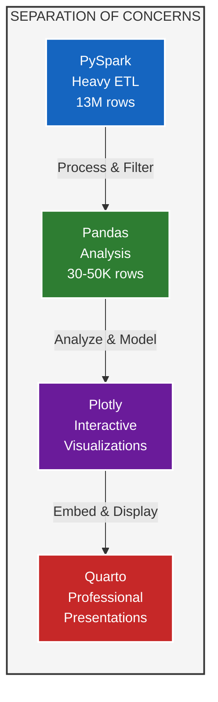

### System Layers

1. **Data Processing Layer** (PySpark)

   - Load and clean 13M row CSV datasets
   - Validate and transform data
   - Engineer features at scale
   - Save to efficient Parquet format

2. **Analysis Layer** (Pandas + PySpark MLlib)

   - Load processed Parquet datasets
   - Statistical analysis and ML models
   - Feature engineering for ML
   - Generate insights and metrics

3. **Visualization Layer** (Plotly)

   - Create interactive charts
   - Generate executive dashboards
   - Export multi-format outputs (HTML/PNG/SVG)
   - Consistent theming and styling

4. **Presentation Layer** (Quarto)

   - Static website generation
   - Dynamic report rendering
   - Embed interactive visualizations
   - Professional documentation

---

## Technology Stack

### Primary Technologies

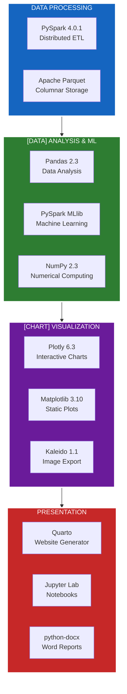

### Technology Decision Matrix

| Layer | Technology | Why? | Alternatives Considered |
|-------|-----------|------|------------------------|
| **ETL** | PySpark | 13M rows, distributed processing, lazy evaluation | Pandas (too slow), Dask (less mature) |
| **Storage** | Parquet | Columnar, compressed, fast reads | CSV (slow), HDF5 (not distributed) |
| **Analysis** | Pandas | Rich API, ecosystem, fast for <100K rows | Polars (new), Spark (overkill) |
| **ML** | PySpark MLlib | Scalable, consistent with PySpark architecture | Scikit-learn (not scalable), TensorFlow (overkill) |
| **Charts** | Plotly | Interactive, web-native, rich features | Altair (limited), D3 (complex) |
| **Website** | Quarto | Reproducible, supports Python, professional | R Markdown (R-focused), Sphinx (docs-only) |

---

## Architecture Diagram

### High-Level System Architecture

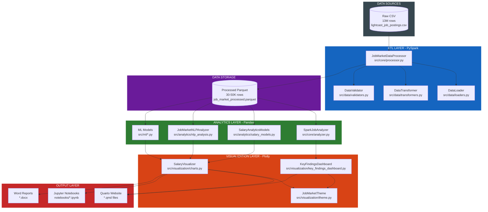

---

## Data Flow

### End-to-End Data Pipeline

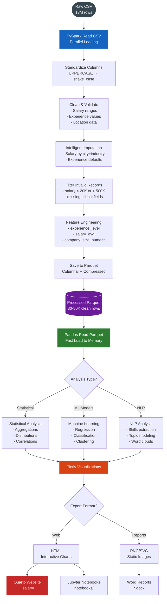

### Layer Boundaries and Contracts

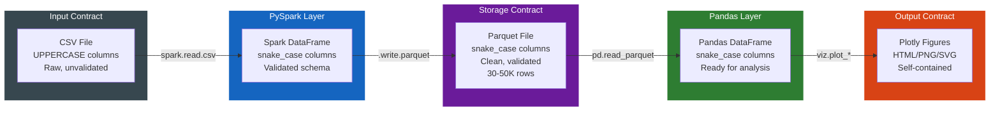

---

## Module Structure

### Directory Organization

```mermaid
graph TB
    ROOT[src/]

    ROOT --> CONFIG[config/<br/>Configuration]
    ROOT --> CORE[core/<br/>PySpark ETL]
    ROOT --> DATA[data/<br/>Data Utilities]
    ROOT --> ANALYTICS[analytics/<br/>Pandas ML]
    ROOT --> ML[ml/<br/>ML Models]
    ROOT --> VIZ[visualization/<br/>Plotly Charts]
    ROOT --> UTILS[utils/<br/>Helpers]

    CONFIG --> CONFIG1[column_mapping.py<br/>Column standards]
    CONFIG --> CONFIG2[settings.py<br/>App config]

    CORE --> CORE1[processor.py<br/>JobMarketDataProcessor]
    CORE --> CORE2[analyzer.py<br/>SparkJobAnalyzer]

    DATA --> DATA1[loaders.py<br/>DataLoader Spark]
    DATA --> DATA2[transformers.py<br/>DataTransformer Spark]
    DATA --> DATA3[validators.py<br/>DataValidator Spark]
    DATA --> DATA4[website_processor.py<br/>Quarto interface]
    DATA --> DATA5[auto_processor.py<br/>Helper functions]

    ANALYTICS --> ANALYTICS1[salary_models.py<br/>SalaryAnalyticsModels]
    ANALYTICS --> ANALYTICS2[nlp_analysis.py<br/>JobMarketNLPAnalyzer]
    ANALYTICS --> ANALYTICS3[predictive_dashboard.py<br/>PredictiveAnalyticsDashboard]
    ANALYTICS --> ANALYTICS4[docx_report_generator.py<br/>ReportGenerator]

    ML --> ML1[regression.py<br/>Salary prediction]
    ML --> ML2[classification.py<br/>Job categorization]
    ML --> ML3[clustering.py<br/>Market segmentation]
    ML --> ML4[feature_engineering.py<br/>Feature prep]
    ML --> ML5[evaluation.py<br/>Model metrics]

    VIZ --> VIZ1[charts.py<br/>SalaryVisualizer]
    VIZ --> VIZ2[key_findings_dashboard.py<br/>KeyFindingsDashboard]
    VIZ --> VIZ3[theme.py<br/>JobMarketTheme]

    UTILS --> UTILS1[spark_utils.py<br/>Spark helpers]

    style ROOT fill:#1a237e,stroke:#fff,color:#fff,stroke-width:4px
    style CONFIG fill:#f57f17,stroke:#fff,color:#000,stroke-width:2px
    style CORE fill:#1565c0,stroke:#fff,color:#fff,stroke-width:3px
    style DATA fill:#0277bd,stroke:#fff,color:#fff,stroke-width:2px
    style ANALYTICS fill:#2e7d32,stroke:#fff,color:#fff,stroke-width:3px
    style ML fill:#558b2f,stroke:#fff,color:#fff,stroke-width:2px
    style VIZ fill:#d84315,stroke:#fff,color:#fff,stroke-width:3px
    style UTILS fill:#455a64,stroke:#fff,color:#fff,stroke-width:2px
```

### Module Responsibilities

| Module | Responsibility | Primary Technology | Output |
|--------|---------------|-------------------|--------|
| **src/config/** | Configuration management | Python | Settings, mappings |
| **src/core/** | Heavy ETL processing | PySpark | Processed DataFrame |
| **src/data/** | Data loading & utilities | PySpark + Pandas | DataFrames |
| **src/analytics/** | ML models & analysis | PySpark MLlib | Models, insights |
| **src/ml/** | Advanced ML | PySpark MLlib | Trained models |
| **src/visualization/** | Charts & dashboards | Plotly | Figures |
| **src/utils/** | Helper functions | Python | Utilities |

---

## Class Diagrams

### 1. Data Processing Classes (PySpark)

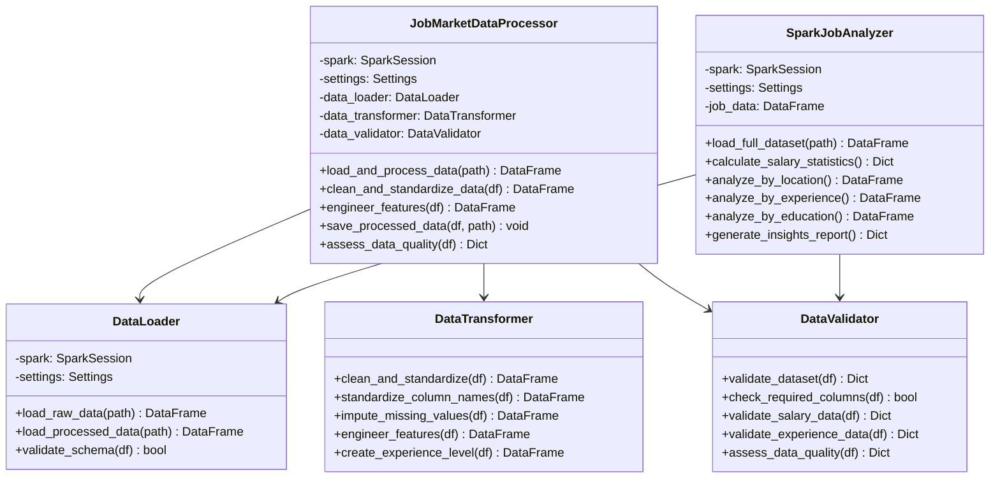

### 2. Analytics Classes (Pandas + ML)

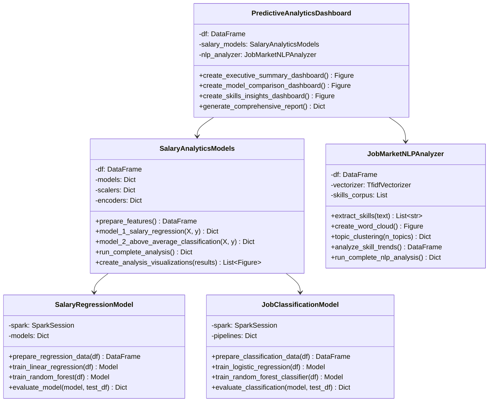

### 3. Visualization Classes (Plotly)

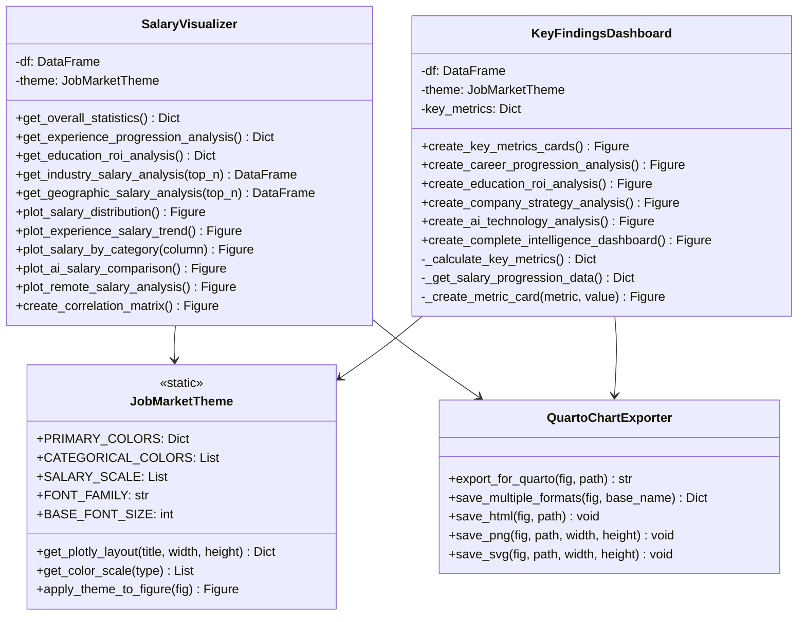

---

## Deployment Architecture

### Local Development

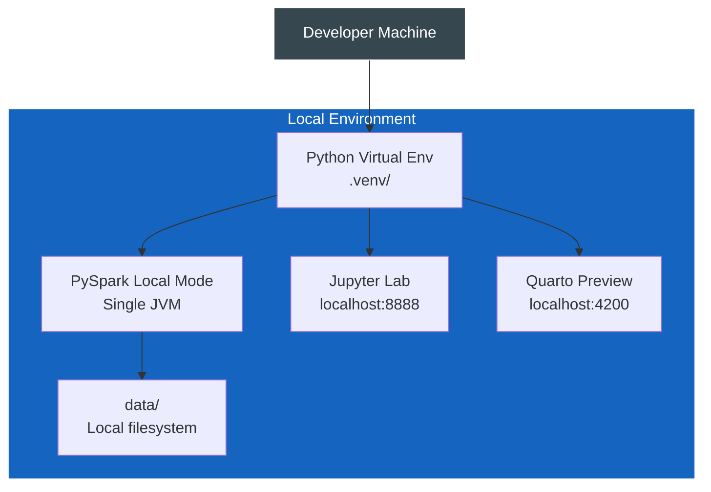

### Production/Scaled Deployment (Future)

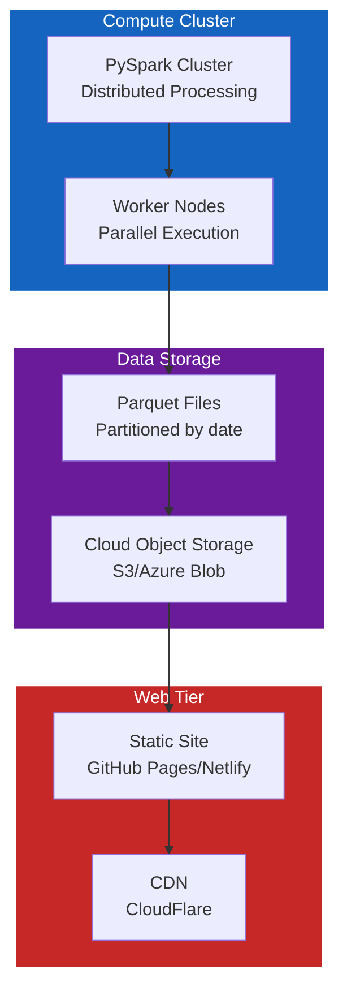

---

## Performance Characteristics

### Processing Performance

| Operation | Technology | Dataset Size | Time | Memory |
|-----------|-----------|--------------|------|--------|
| Load raw CSV | PySpark | 13M rows | ~2-3 min | 4-8 GB |
| Clean & transform | PySpark | 13M rows | ~5-10 min | 4-8 GB |
| Save to Parquet | PySpark | 30-50K rows | ~10-30 sec | 2-4 GB |
| Load Parquet | Pandas | 30-50K rows | ~1-2 sec | 500 MB |
| Statistical analysis | Pandas | 30-50K rows | <1 sec | 500 MB |
| ML training | PySpark MLlib | 30-50K rows | 5-30 sec | 1-2 GB |
| Generate chart | Plotly | 30-50K points | 1-5 sec | 200 MB |
| Render Quarto page | Quarto | N/A | 5-15 sec | 500 MB |

### Storage Efficiency

```bash
Raw CSV:        ~2.5 GB (13M rows, 131 columns)
                ↓ PySpark processing + filtering
Processed Parquet: ~120 MB (30-50K rows, 132 columns)
                ↓ 95% size reduction
```

**Parquet Benefits**:

- **Columnar storage**: Read only needed columns
- **Compression**: Built-in snappy/gzip compression
- **Type efficiency**: Proper data types vs. string CSV
- **Fast reads**: Optimized for analytical queries

---

## Security & Data Privacy

### Data Handling

1. **No PII storage**: Job postings are anonymized
2. **Local processing**: All data stays on local machine
3. **No external APIs**: Self-contained processing
4. **Version control**: Data files in `.gitignore`

### Access Control

- **Development**: Local file system permissions
- **Production**: Cloud IAM roles (if deployed)
- **API keys**: Environment variables (not committed)

---

## Monitoring & Observability

### Logging

```python
import logging

# Configure logging
logging.basicConfig(
    level=logging.INFO,
    format='%(asctime)s - %(name)s - %(levelname)s - %(message)s'
)

logger = logging.getLogger(__name__)
logger.info("Processing started...")
```

### Metrics to Track

1. **Data Quality**:
   - Missing value percentages
   - Outlier counts
   - Schema violations

2. **Performance**:
   - Processing time per stage
   - Memory usage peaks
   - Parquet file sizes

3. **Model Performance**:
   - R² scores
   - Classification accuracy
   - Feature importance

---

## Future Enhancements

### Scalability

1. **Distributed Spark**: Move to multi-node cluster for larger datasets
2. **Incremental updates**: Process only new/changed data
3. **Data partitioning**: Partition Parquet by date/region
4. **Caching layer**: Redis for frequently accessed aggregations

### Features

1. **Real-time updates**: Stream processing with Spark Streaming
2. **Interactive dashboards**: Add Streamlit/Dash for live exploration
3. **API layer**: REST API for programmatic access
4. **Automated reports**: Scheduled report generation and delivery

### MLOps

1. **Model versioning**: MLflow for experiment tracking
2. **Model registry**: Centralized model storage
3. **A/B testing**: Compare model versions
4. **Monitoring**: Track model performance over time

---

## References

- [PySpark Documentation](https://spark.apache.org/docs/latest/api/python/)
- [Pandas Documentation](https://pandas.pydata.org/docs/)
- [Plotly Python](https://plotly.com/python/)
- [Quarto](https://quarto.org/)
- [PySpark MLlib](https://spark.apache.org/docs/latest/ml-guide.html)

---

**For implementation details and usage patterns**, see [DESIGN.md](DESIGN.md)

**For project overview and setup**, see [README.md](README.md)
