# System Architecture

**Tech Career Intelligence Platform** - Comprehensive architecture documentation with Mermaid diagrams.

---

## Table of Contents

1. [System Overview](#system-overview)
2. [Architecture Diagram](#architecture-diagram)
3. [Module Structure](#module-structure)
4. [Class Diagrams](#class-diagrams)
5. [Data Flow](#data-flow)
6. [Quarto Website Integration](#quarto-website-integration)
7. [Jupyter Notebooks](#jupyter-notebooks)
8. [Configuration Management](#configuration-management)

---

## System Overview

The Tech Career Intelligence Platform is a data-driven web application built with **Quarto**, **Python**, and **Plotly** to analyze job market trends, salary patterns, and career progression insights.

### Core Principles

1. **Process Once, Use Many Times**: Raw data is processed once into Parquet format, then loaded directly for all analyses
2. **Abstraction Layer**: All business logic resides in `src/` modules; QMD files are pure presentation layer
3. **Column Standardization**: All processed data uses `snake_case` column names
4. **Configuration-Driven**: Centralized column mapping and settings in `src/config/`

### Technology Stack

---

## Architecture Diagram

---

## Module Structure

### Directory Tree

---

## Class Diagrams

### 1. Data Processing Classes

### 2. Visualization Classes

### 3. Analytics Classes

### 4. Configuration System

```mermaid
classDiagram
    class ColumnMapping {
        <<module>>
        +LIGHTCAST_COLUMN_MAPPING: Dict
        +ANALYSIS_COLUMNS: Dict
        +DERIVED_COLUMNS: List
        +EXPERIENCE_CATEGORIES: Dict
        +get_analysis_column(key) str
        +map_lightcast_columns(df) DataFrame
    }
    
    class Settings {
        +raw_data_path: str
        +processed_data_path: str
        +output_dir: str
        +min_salary: int
        +max_salary: int
        +required_columns: List
        +default_chart_height: int
        +test_size: float
        +random_state: int
    }
    
    note for ColumnMapping "Maps:\nUPPERCASE → snake_case\nLogical → Actual columns"
    note for Settings "Centralized\napplication config"
```

---

## Data Flow

### One-Time Processing Flow

```mermaid
flowchart TD
    START([python scripts/create_processed_data.py])
    RAW[(data/raw/lightcast_job_postings.csv<br/>32,364 records<br/>UPPERCASE columns)]
    
    START --> LOAD[Load Raw CSV]
    LOAD --> RAW
    RAW --> STANDARDIZE[standardize_columns]
    
    STANDARDIZE --> MAP[Apply LIGHTCAST_COLUMN_MAPPING<br/>TITLE_NAME → title<br/>COMPANY_NAME → company]
    MAP --> SNAKE[Convert UPPERCASE → snake_case<br/>CITY_NAME → city_name]
    SNAKE --> DECODE[Decode base64 locations<br/>CITY base64 → city_name plain text]
    DECODE --> JSON[Parse JSON locations<br/>LOCATION JSON → coordinates]
    
    JSON --> SALARY[Compute salary_avg]
    
    subgraph SALARY_COMPUTE[" "]
        S1[Check for SALARY_AVG]
        S2{Exists?}
        S3[Use SALARY_AVG directly]
        S4[Compute from salary_min/max]
        S5[Intelligent Imputation<br/>Group by: city, experience,<br/>title, industry]
        
        S1 --> S2
        S2 -->|Yes| S3
        S2 -->|No| S4
        S4 --> S5
    end
    
    SALARY --> SALARY_COMPUTE
    SALARY_COMPUTE --> VALIDATE[Validate salary data<br/>Range: 20K-500K<br/>Remove outliers]
    
    VALIDATE --> EXPERIENCE[Process experience data<br/>experience_min/max → numeric<br/>Derived: avg, range]
    
    EXPERIENCE --> CLEAN[Clean & Standardize<br/>Remove nulls<br/>Trim strings]
    
    CLEAN --> PARQUET[(data/processed/<br/>job_market_processed.parquet<br/>32,364 records<br/>132 snake_case columns<br/>117.8 MB)]
    
    PARQUET --> DONE([✅ Ready for Runtime])
    
    style START fill:#4caf50,stroke:#1b5e20,stroke-width:3px,color:#fff
    style DONE fill:#4caf50,stroke:#1b5e20,stroke-width:3px,color:#fff
    style RAW fill:#ff9800,stroke:#e65100,stroke-width:2px
    style PARQUET fill:#2196f3,stroke:#0d47a1,stroke-width:3px,color:#fff
    style SALARY_COMPUTE fill:#fff3e0,stroke:#e65100,stroke-width:2px
```

### Runtime Data Flow (Quarto Website)

```mermaid
flowchart TD
    START([quarto preview])
    QMD[*.qmd files load]
    
    START --> QMD
    QMD --> IMPORT[Import website_processor]
    
    IMPORT --> GET_DF[get_processed_dataframe]
    
    GET_DF --> CHECK{Parquet exists?}
    
    CHECK -->|Yes| LOAD_FAST[Load Parquet<br/>~100ms ⚡]
    CHECK -->|No| LOAD_SLOW[Process Raw CSV<br/>~5s 🐌]
    
    LOAD_FAST --> DF[DataFrame<br/>snake_case columns]
    LOAD_SLOW --> DF
    
    DF --> SUMMARY[get_website_data_summary<br/>total_records, salary_range, etc.]
    
    SUMMARY --> VIZ[Create Visualizations]
    
    subgraph VIZ_PROCESS[" "]
        V1[SalaryVisualizer df]
        V2[get_analysis_column 'salary'<br/>→ Returns 'salary_avg']
        V3[KeyFindingsDashboard df]
        V4[create_key_metrics_cards]
        V5[create_career_progression]
        
        V1 --> V2
        V3 --> V4
        V3 --> V5
    end
    
    VIZ --> VIZ_PROCESS
    
    VIZ_PROCESS --> FIGS[Generate figures/]
    
    subgraph FORMATS[" "]
        F1[*.html - Interactive Plotly]
        F2[*.png - Static for DOCX]
        F3[*.svg - Vector for scaling]
    end
    
    FIGS --> FORMATS
    FORMATS --> RENDER[Render HTML pages]
    RENDER --> OUTPUT[Output to _salary/]
    OUTPUT --> DONE([✅ Website Ready])
    
    style START fill:#4caf50,stroke:#1b5e20,stroke-width:3px,color:#fff
    style DONE fill:#4caf50,stroke:#1b5e20,stroke-width:3px,color:#fff
    style LOAD_FAST fill:#4caf50,stroke:#1b5e20,stroke-width:2px
    style LOAD_SLOW fill:#f44336,stroke:#b71c1c,stroke-width:2px
    style VIZ_PROCESS fill:#e3f2fd,stroke:#1565c0,stroke-width:2px
    style FORMATS fill:#f3e5f5,stroke:#6a1b9a,stroke-width:2px
```

### Column Name Resolution Flow

```mermaid
flowchart LR
    QMD[QMD File needs:<br/>'industry' analysis]
    
    QMD --> IMPORT[Import get_analysis_column]
    IMPORT --> CALL[get_analysis_column 'industry']
    CALL --> LOOKUP[Lookup ANALYSIS_COLUMNS]
    
    subgraph MAPPING[" "]
        M1["ANALYSIS_COLUMNS = {<br/>'industry': 'naics2_name'<br/>}"]
    end
    
    LOOKUP --> MAPPING
    MAPPING --> RETURN[Returns: 'naics2_name']
    
    RETURN --> USE[visualizer.plot_salary_by_category<br/>'naics2_name']
    
    USE --> CHECK{Column<br/>exists?}
    CHECK -->|Yes| PLOT[Create Chart ✅]
    CHECK -->|No| ERROR[Error: Column not found ❌]
    
    style QMD fill:#e3f2fd,stroke:#1565c0,stroke-width:2px
    style MAPPING fill:#fff9c4,stroke:#f57f17,stroke-width:2px
    style PLOT fill:#4caf50,stroke:#1b5e20,stroke-width:2px,color:#fff
    style ERROR fill:#f44336,stroke:#b71c1c,stroke-width:2px,color:#fff
```

---

## Quarto Website Integration

### Page Architecture Flow

```mermaid
flowchart TD
    subgraph QMD_STRUCTURE["📄 QMD File Structure"]
        YAML[1. YAML Header<br/>title, format, theme]
        DATA_LOAD[2. Data Loading Block<br/>get_processed_dataframe]
        VIZ_BLOCKS[3. Visualization Blocks<br/>SalaryVisualizer<br/>KeyFindingsDashboard]
    end
    
    YAML --> DATA_LOAD
    DATA_LOAD --> VIZ_BLOCKS
    
    subgraph RULES["✅ QMD Rules"]
        R1[✅ Use abstraction layer classes]
        R2[✅ Use get_analysis_column]
        R3[✅ Keep logic in src/ modules]
        R4[❌ NO groupby, agg in QMD]
        R5[❌ NO data wrangling in QMD]
        R6[❌ NO hardcoded column names]
    end
    
    VIZ_BLOCKS -.follows.-> RULES
    
    style QMD_STRUCTURE fill:#e3f2fd,stroke:#1565c0,stroke-width:3px
    style RULES fill:#f3e5f5,stroke:#6a1b9a,stroke-width:2px
    style R1 fill:#c8e6c9,stroke:#2e7d32
    style R2 fill:#c8e6c9,stroke:#2e7d32
    style R3 fill:#c8e6c9,stroke:#2e7d32
    style R4 fill:#ffcdd2,stroke:#c62828
    style R5 fill:#ffcdd2,stroke:#c62828
    style R6 fill:#ffcdd2,stroke:#c62828
```

### Page Relationships

### Page Descriptions

| File | Purpose | Key Visualizations |
|------|---------|-------------------|
| `index.qmd` | Homepage with key metrics | Overview cards, navigation |
| `data-pipeline.qmd` | Data processing pipeline demo | Pipeline stats, processing flow |
| `salary-insights.qmd` | Comprehensive salary analysis | Distribution, experience, industry, geography |
| `market-dashboard.qmd` | Executive market overview | Geographic trends, market insights, AI analysis |
| `predictive-analytics.qmd` | ML models and predictions | Regression, classification, salary predictions |
| `tech-career-intelligence-report.qmd` | Downloadable DOCX report | Consolidated analysis |

---

## Jupyter Notebooks

### Notebook Structure

### Notebook vs QMD Comparison

```mermaid
graph LR
    subgraph JUPYTER["📓 Jupyter Notebooks"]
        J1[Purpose: Exploration]
        J2[Audience: Data Scientists]
        J3[Execution: Manual]
        J4[Data: Raw or Processed]
        J5[Logic: Inline allowed]
    end
    
    subgraph QMD["📄 Quarto QMD Files"]
        Q1[Purpose: Production]
        Q2[Audience: General Users]
        Q3[Execution: Automatic]
        Q4[Data: Processed only]
        Q5[Logic: Abstraction layer only]
    end
    
    J1 -.vs.-> Q1
    J2 -.vs.-> Q2
    J3 -.vs.-> Q3
    J4 -.vs.-> Q4
    J5 -.vs.-> Q5
    
    style JUPYTER fill:#ff9800,stroke:#e65100,stroke-width:2px
    style QMD fill:#2196f3,stroke:#0d47a1,stroke-width:2px,color:#fff
```

---

## Configuration Management

### Column Mapping System

### Derived Columns Flow

```mermaid
flowchart LR
    subgraph INPUT["Input Columns"]
        I1[salary_min]
        I2[salary_max]
        I3[experience_min]
        I4[experience_max]
        I5[CITY base64]
    end
    
    subgraph PIPELINE["Data Pipeline"]
        P1[Compute salary_avg<br/>salary_min + salary_max / 2]
        P2[Compute experience_avg<br/>experience_min + max / 2]
        P3[Decode CITY<br/>base64 → city_name]
        P4[Create experience_range<br/>max - min]
        P5[Flag ai_related<br/>Check skills for AI/ML]
    end
    
    subgraph OUTPUT["Derived Columns"]
        O1[salary_avg ✨]
        O2[experience_avg ✨]
        O3[city_name ✨]
        O4[experience_range ✨]
        O5[ai_related ✨]
    end
    
    I1 --> P1
    I2 --> P1
    I3 --> P2
    I4 --> P2
    I4 --> P4
    I3 --> P4
    I5 --> P3
    
    P1 --> O1
    P2 --> O2
    P3 --> O3
    P4 --> O4
    P5 --> O5
    
    style INPUT fill:#ffebee,stroke:#c62828,stroke-width:2px
    style PIPELINE fill:#e3f2fd,stroke:#1565c0,stroke-width:2px
    style OUTPUT fill:#c8e6c9,stroke:#2e7d32,stroke-width:2px
```

---

## Summary

### Key Architectural Decisions

### Class Responsibilities

```mermaid
graph TB
    subgraph DATA["📊 Data Classes"]
        D1[website_processor<br/>Load & process data]
        D2[JobMarketDataCleaner<br/>Clean & validate]
        D3[DataLoader<br/>Load from files]
    end
    
    subgraph VIZ["📈 Visualization Classes"]
        V1[SalaryVisualizer<br/>Salary-focused charts]
        V2[KeyFindingsDashboard<br/>Executive dashboards]
        V3[JobMarketTheme<br/>Consistent styling]
    end
    
    subgraph ANALYTICS["🤖 Analytics Classes"]
        A1[SalaryAnalyticsModels<br/>ML models]
        A2[JobMarketNLPAnalyzer<br/>Skills extraction]
        A3[PredictiveAnalyticsDashboard<br/>ML dashboards]
    end
    
    QMD[*.qmd Files] --> DATA
    QMD --> VIZ
    QMD --> ANALYTICS
    
    DATA --> VIZ
    VIZ --> A3
    
    style QMD fill:#4caf50,stroke:#1b5e20,stroke-width:3px,color:#fff
    style DATA fill:#2196f3,stroke:#0d47a1,stroke-width:2px,color:#fff
    style VIZ fill:#9c27b0,stroke:#4a148c,stroke-width:2px,color:#fff
    style ANALYTICS fill:#ff9800,stroke:#e65100,stroke-width:2px
```

### Data Flow Principles

---

**Last Updated**: October 2025  
**Version**: 3.0 (Mermaid Diagrams Edition)  
**Format**: Markdown with Mermaid flowcharts, class diagrams, and mind maps

