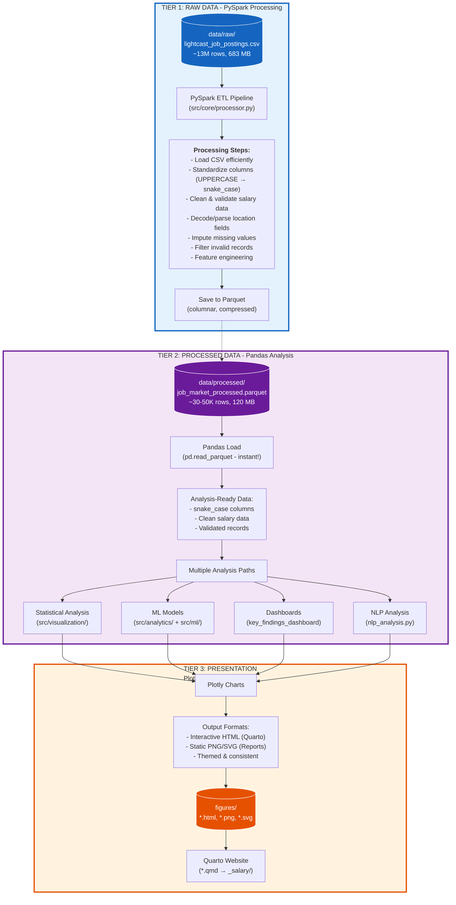

# Technical Design & Implementation Guide

Scalable data processing with PySpark + Interactive analysis with Pandas/Plotly

> See [README.md](README.md) for project overview
> See [ARCHITECTURE.md](ARCHITECTURE.md) for detailed system diagrams
> Last Updated: October 2025

---

## Table of Contents

1. [Architecture Overview](#architecture-overview)
2. [Technology Stack](#technology-stack)
3. [Data Processing Strategy](#data-processing-strategy)
4. [System Components](#system-components)
5. [Usage Patterns](#usage-patterns)
6. [Development Workflow](#development-workflow)

---

## Architecture Overview

### Design Philosophy

#### Separation of Concerns: Use the right tool for the right job :point_left:

- **PySpark**: Heavy data processing (ETL, cleaning, feature engineering) on large datasets
- **Pandas**: Interactive analysis and visualization on processed datasets
- **Plotly**: Rich interactive visualizations for web and reports
- **Parquet**: Efficient columnar storage for fast analytics

### Core Principles

1. **Process Once, Use Many Times**: `PySpark processes raw data → Parquet → Pandas analytics`
2. **Layered Architecture**: Clear separation between data processing, analysis, and presentation
3. **Consistent Column Standards**: All processed data uses `snake_case` columns
4. **Configuration-Driven**: Centralized mappings in `src/config/`
5. **Type Safety**: Proper DataFrame contracts at layer boundaries

---

## Technology Stack

### Data Processing Layer (PySpark)

#### Use For

- Loading large CSV files
- Data cleaning and validation
- Feature engineering at scale
- Aggregations and transformations
- Saving to Parquet

#### Components

- `src/core/processor.py` - JobMarketDataProcessor
- `src/core/analyzer.py` - SparkJobAnalyzer
- `src/data/loaders.py` - DataLoader (Spark)
- `src/data/transformers.py` - DataTransformer (Spark)
- `src/data/validators.py` - DataValidator (Spark)

### Analysis Layer (PySpark MLlib Only)

#### Use For

- Machine learning models (PySpark MLlib for distributed ML)
- NLP analysis (PySpark MLlib for TF-IDF, clustering, Word2Vec)
- Statistical analysis (Pandas for quick exploration)
- Feature engineering for ML (PySpark transformers)

#### Components

- `src/analytics/salary_models.py` - SalaryAnalyticsModels (PySpark MLlib)
- `src/analytics/nlp_analysis.py` - JobMarketNLPAnalyzer (PySpark MLlib)
- `src/ml/` - Advanced ML models (PySpark MLlib)

### Visualization Layer (Plotly + Matplotlib)

**Use For**:

- Interactive charts for Quarto website
- Static exports for Word reports
- Dashboard components
- Executive visualizations

**Components**:

- `src/visualization/charts.py` - SalaryVisualizer
- `src/visualization/key_findings_dashboard.py` - KeyFindingsDashboard
- `src/visualization/theme.py` - JobMarketTheme

### Presentation Layer (Quarto)

**Use For**:

- Website generation
- Report rendering
- Embedding interactive charts
- Documentation

**Components**:

- `*.qmd` files (index, salary-insights, predictive-analytics, etc.)
- HTML output with embedded Plotly charts

---

## Data Processing Strategy

### Three-Tier Data Pipeline



---

## System Components

### 1. Configuration (`src/config/`)

**Purpose**: Centralized settings and column mappings

#### `column_mapping.py`

```python
# Mapping from raw Lightcast columns to standardized names
LIGHTCAST_COLUMN_MAPPING = {
    'SALARY_FROM': 'salary_min',
    'SALARY_TO': 'salary_max',
    'TITLE_NAME': 'title',
    'CITY_NAME': 'city_name',
    'NAICS2_NAME': 'industry',
    # ... more mappings
}

# Analysis-friendly column lookup
ANALYSIS_COLUMNS = {
    'salary': 'salary_avg',
    'city': 'city_name',
    'industry': 'industry',
}

def get_analysis_column(key: str) -> str:
    """Get standardized column name for analysis"""
    return ANALYSIS_COLUMNS.get(key, key)
```

#### `settings.py`

```python
class Settings:
    """Application configuration"""

    # Data paths
    RAW_DATA_PATH = "data/raw/lightcast_job_postings.csv"
    PROCESSED_DATA_PATH = "data/processed/job_market_processed.parquet"

    # Spark configuration
    SPARK_MEMORY = "8g"
    SPARK_DRIVER_MEMORY = "4g"

    # Data validation
    MIN_SALARY = 20000
    MAX_SALARY = 500000

    # Feature engineering
    EXPERIENCE_BINS = [0, 2, 5, 10, 20, float('inf')]
    EXPERIENCE_LABELS = ['Entry', 'Mid', 'Senior', 'Executive', 'C-Level']
```

### 2. Data Processing (`src/core/` + `src/data/`)

**Purpose**: PySpark-based ETL pipeline

#### `src/core/processor.py` - JobMarketDataProcessor

Main entry point for data processing:

```python
from src.core import JobMarketDataProcessor

# Initialize processor with Spark
processor = JobMarketDataProcessor()

# Process raw data and save to Parquet
df = processor.load_and_process_data()

# Processed data now available at:
# data/processed/job_market_processed.parquet
```

**Key Methods**:

- `load_and_process_data()` - Full ETL pipeline
- `clean_and_standardize_data()` - Data cleaning
- `engineer_features()` - Feature creation
- `save_processed_data()` - Save to Parquet

#### `src/core/analyzer.py` - SparkJobAnalyzer


Advanced PySpark analysis for large-scale operations:

```python
from src.core import SparkJobAnalyzer

analyzer = SparkJobAnalyzer()
analyzer.load_full_dataset()

# Run large-scale aggregations
salary_stats = analyzer.calculate_salary_statistics()
location_analysis = analyzer.analyze_by_location()
```

#### `src/data/loaders.py` - DataLoader

```python
class DataLoader:
    """Load data with PySpark"""

    def load_raw_data(self, path: str) -> DataFrame:
        """Load large CSV with Spark"""
        return self.spark.read \
            .option("header", "true") \
            .option("inferSchema", "true") \
            .csv(path)

    def load_processed_data(self, path: str) -> DataFrame:
        """Load Parquet with Spark"""
        return self.spark.read.parquet(path)
```

### 3. Analysis (`src/analytics/` + `src/ml/`)

**Purpose**: Pandas-based analysis and ML models

#### `src/analytics/salary_models.py` - SalaryAnalyticsModels (PySpark MLlib)

```python
import pandas as pd
from src.analytics import SalaryAnalyticsModels

# Load processed data with Pandas
df = pd.read_parquet('data/processed/job_market_processed.parquet')

# Run ML models with PySpark MLlib (distributed machine learning)
models = SalaryAnalyticsModels(df)
results = models.run_complete_analysis()

# Results include:
# - Multiple linear regression (PySpark MLlib)
# - Random Forest classification (PySpark MLlib)
# - Feature importance from distributed models
# - Model evaluation metrics (R², RMSE, Accuracy, F1)

# Models automatically:
# 1. Convert Pandas → Spark DataFrame
# 2. Train with PySpark MLlib
# 3. Return results as Python dict
```

#### `src/analytics/nlp_analysis.py` - JobMarketNLPAnalyzer (PySpark MLlib)

```python
from src.analytics import JobMarketNLPAnalyzer

# NLP analysis with PySpark MLlib
nlp = JobMarketNLPAnalyzer(df)
skills = nlp.extract_skills_from_text()  # PySpark text processing
clusters = nlp.cluster_skills_by_topic()  # PySpark TF-IDF + KMeans
correlations = nlp.analyze_skill_salary_correlation()  # PySpark aggregations
word_cloud = nlp.create_word_cloud()  # Visualization only

# All NLP operations use PySpark MLlib:
# - HashingTF + IDF for TF-IDF vectorization
# - KMeans for clustering
# - Word2Vec for embeddings
```

#### `src/ml/` - Advanced Machine Learning Models (PySpark MLlib)

All ML models use PySpark MLlib for distributed machine learning:

- `regression.py` - Salary prediction models (Linear, Random Forest)
- `classification.py` - Job categorization (Logistic, Random Forest)
- `clustering.py` - Market segmentation (KMeans)
- `feature_engineering.py` - ML feature preparation (PySpark transformers)
- `evaluation.py` - Model performance metrics (PySpark evaluators)
- `salary_disparity.py` - Comprehensive analysis orchestration

**Note**: These provide advanced PySpark MLlib capabilities for large-scale ML workloads.

#### `src/ml/regression.py` - SalaryRegressionModel

```python
from src.ml import SalaryRegressionModel

# Train salary prediction model with PySpark MLlib
model = SalaryRegressionModel(df)
results = model.train_model(
    features=['min_years_experience', 'naics2_name', 'city_name'],
    target='salary_avg'
)

# Results include:
# - Trained LinearRegression or RandomForestRegressor
# - R² score, RMSE, MAE metrics
# - Feature importance (for tree-based models)
# - Predictions on test set
```

**Key Features**:
- PySpark MLlib regression (LinearRegression, RandomForestRegressor)
- Automatic feature vectorization
- Train/test split with validation
- Model performance evaluation

#### `src/ml/classification.py` - JobClassificationModel

```python
from src.ml import JobClassificationModel

# Classify jobs by seniority level
classifier = JobClassificationModel(df)
results = classifier.classify_seniority_level(
    features=['salary_avg', 'min_years_experience', 'title'],
    target='seniority_level'
)

# Results include:
# - Trained RandomForestClassifier or LogisticRegression
# - Accuracy, F1-score, precision, recall
# - Confusion matrix
# - Class predictions
```

**Use Cases**:
- Job level classification (Entry/Mid/Senior/Executive)
- Remote vs On-site classification
- Industry categorization

#### `src/ml/clustering.py` - JobMarketClusterer

```python
from src.ml import JobMarketClusterer

# Cluster jobs by characteristics
clusterer = JobMarketClusterer(df)
clusters = clusterer.cluster_jobs(
    features=['salary_avg', 'min_years_experience', 'naics2_name'],
    n_clusters=5
)

# Results include:
# - Cluster assignments for each job
# - Cluster centers (centroids)
# - Silhouette score (cluster quality)
# - Cluster profiles (statistics per cluster)
```

**Applications**:
- Market segmentation
- Job similarity analysis
- Identifying job archetypes

#### `src/ml/feature_engineering.py` - SalaryDisparityFeatureEngineer

```python
from src.ml import SalaryDisparityFeatureEngineer

# Engineer features for ML models
engineer = SalaryDisparityFeatureEngineer(df)
feature_df = engineer.create_features()

# Created features:
# - Salary percentiles by city/industry
# - Experience-to-salary ratios
# - Industry salary rankings
# - Geographic salary indices
# - Education premium calculations
```

**Purpose**: Transform raw data into ML-ready features using PySpark transformers.

#### `src/ml/evaluation.py` - ModelEvaluator

```python
from src.ml import ModelEvaluator

# Evaluate model performance
evaluator = ModelEvaluator()

# For regression models
reg_metrics = evaluator.evaluate_regression(y_true, y_pred)
# Returns: R², RMSE, MAE, MAPE

# For classification models
clf_metrics = evaluator.evaluate_classification(y_true, y_pred)
# Returns: Accuracy, F1, Precision, Recall, Confusion Matrix

# For clustering models
cluster_metrics = evaluator.evaluate_clustering(X, cluster_labels)
# Returns: Silhouette score, Davies-Bouldin index
```

**Purpose**: Standardized model evaluation using PySpark MLlib evaluators.

#### `src/ml/salary_disparity.py` - SalaryDisparityAnalyzer

```python
from src.ml import SalaryDisparityAnalyzer

# Comprehensive salary disparity analysis
analyzer = SalaryDisparityAnalyzer(df)

# Run full analysis pipeline
results = analyzer.run_complete_analysis()

# Includes:
# - Gender pay gap analysis
# - Geographic salary disparities
# - Industry salary comparisons
# - Experience-based pay progression
# - Education ROI analysis
```

**Purpose**: Orchestrates multiple ML models for comprehensive salary analysis.

#### `src/analytics/predictive_dashboard.py` - PredictiveAnalyticsDashboard

```python
from src.analytics import PredictiveAnalyticsDashboard

# Create predictive analytics dashboard
dashboard = PredictiveAnalyticsDashboard(df)

# Generate comprehensive dashboard
complete_dashboard = dashboard.create_complete_dashboard()

# Individual components
salary_predictions = dashboard.create_salary_prediction_panel()
market_trends = dashboard.create_market_trends_panel()
skill_demand = dashboard.create_skill_demand_forecast()
career_paths = dashboard.create_career_path_recommendations()
```

**Purpose**: Combine ML predictions with interactive visualizations for decision support.

#### `src/analytics/docx_report_generator.py` - JobMarketReportGenerator

```python
from src.analytics import generate_comprehensive_docx_report

# Generate programmatic DOCX report (alternative to Quarto)
report_path = generate_comprehensive_docx_report(
    df=df,
    output_path="job_market_report.docx"
)

# Report includes:
# - Executive summary
# - Model results and explanations
# - Skills analysis and insights
# - Strategic recommendations
# - Technical appendices
```

**Note**: Provides programmatic DOCX generation with full styling control. Currently, Quarto DOCX export is preferred for most use cases.

### 4. Visualization (`src/visualization/`)

**Purpose**: Plotly-based interactive and static charts

#### `src/visualization/charts.py` - display_figure (Utility Function)

```python
from src.visualization.charts import display_figure

# Simplified figure display and saving for Quarto/notebooks
fig = go.Figure(...)
display_figure(fig, "my_chart")  # Saves to figures/my_chart.png and displays

# Benefits:
# - Centralized figure saving logic
# - Automatic directory creation
# - High-quality PNG export (1200x800, scale=2)
# - Consistent across QMD files and notebooks
# - Proper error handling
```

#### `src/visualization/charts.py` - SalaryVisualizer

```python
from src.visualization import SalaryVisualizer, display_figure
import pandas as pd

df = pd.read_parquet('data/processed/job_market_processed.parquet')
viz = SalaryVisualizer(df)

# Create charts
salary_dist = viz.plot_salary_distribution()
experience_prog = viz.plot_experience_salary_trend()
geo_analysis = viz.plot_salary_by_category('city_name')
correlation = viz.create_correlation_matrix()

# Display using centralized utility
display_figure(salary_dist, "salary_distribution")  # Recommended for Quarto
salary_dist.show()  # Direct display (notebook)
salary_dist.write_html('figure.html')  # Manual save
```

#### `src/visualization/key_findings_dashboard.py` - KeyFindingsDashboard

```python
from src.visualization import KeyFindingsDashboard

dashboard = KeyFindingsDashboard(df)

# Executive dashboards
metrics = dashboard.create_key_metrics_cards()
career = dashboard.create_career_progression_analysis()
education = dashboard.create_education_roi_analysis()
complete = dashboard.create_complete_intelligence_dashboard()
```

#### `src/visualization/theme.py` - JobMarketTheme

```python
from src.visualization.theme import JobMarketTheme

# Consistent styling across all charts
layout = JobMarketTheme.get_plotly_layout(
    title="Salary Distribution",
    width=1200,
    height=600
)

fig.update_layout(**layout)
```

#### `src/visualization/charts.py` - QuartoChartExporter

```python
from src.visualization import QuartoChartExporter

# Export charts optimized for Quarto
exporter = QuartoChartExporter(df)

# Batch export multiple charts
figures = exporter.export_all_charts(
    output_dir='figures/',
    formats=['html', 'png', 'svg']
)

# Individual chart export
salary_chart = exporter.export_salary_analysis()
geographic_chart = exporter.export_geographic_analysis()
industry_chart = exporter.export_industry_comparison()

# Benefits:
# - Optimized dimensions for Quarto (1200x800)
# - Multi-format export (HTML/PNG/SVG/PDF)
# - Consistent styling across all exports
# - Automatic file naming and organization
```

**Purpose**: Batch export and optimize charts specifically for Quarto integration.

### 5. Website Interface (`src/data/website_processor.py`)

**Purpose**: Simplified interface for Quarto QMD files

```python
# In QMD files - simple, clean API
from src.data.website_processor import (
    load_and_process_data,
    get_processed_dataframe,
    get_website_data_summary
)
from src.visualization.charts import display_figure

# Load processed data (Pandas)
df = get_processed_dataframe()

# Get summary statistics
summary = get_website_data_summary()

# Use in visualizations
from src.visualization import SalaryVisualizer
viz = SalaryVisualizer(df)
fig = viz.plot_salary_distribution()

# Display and save figure (recommended for Quarto)
display_figure(fig, "salary_distribution")
```

---

## Usage Patterns

### Pattern 1: Initial Data Processing (PySpark)

**When**: First time setup or when raw data changes

**How**:

```python
# scripts/generate_processed_data.py (or use website_processor directly)
from src.core import JobMarketDataProcessor
from src.config.settings import Settings

def main():
    print("Processing raw data with PySpark...")

    # Initialize processor
    settings = Settings()
    processor = JobMarketDataProcessor(settings=settings)

    # Process raw CSV with PySpark (13M rows)
    # This automatically saves to Parquet
    spark_df = processor.load_and_process_data(
        data_path="data/raw/lightcast_job_postings.csv"
    )

    print(f"Processed {spark_df.count():,} records")
    print("Saved to data/processed/job_market_processed.parquet")

    # Stop Spark to free memory
    processor.spark.stop()

    # Now Pandas can load the much smaller Parquet file
    import pandas as pd
    df = pd.read_parquet('data/processed/job_market_processed.parquet')
    print(f"Pandas loaded {len(df):,} records for analysis")

if __name__ == "__main__":
    main()
```

**Run**: `python scripts/generate_processed_data.py`

**Key Points**:

- PySpark processes ALL 13M rows from CSV
- PySpark filters/cleans and saves to Parquet (~30-50K rows)
- Spark session stopped to free memory
- Pandas loads the small Parquet for analysis (fast!)

### Pattern 2: Analysis in Notebooks (Pandas)

**When**: Exploratory analysis, ML experiments, visualization development

**How**:

```python
# notebooks/analysis.ipynb
import pandas as pd
from src.visualization import SalaryVisualizer
from src.analytics import SalaryAnalyticsModels

# Load processed data (fast with Pandas)
df = pd.read_parquet('../data/processed/job_market_processed.parquet')

# Explore data
print(df.shape)
print(df['salary_avg'].describe())

# Create visualizations
viz = SalaryVisualizer(df)
viz.plot_salary_distribution().show()

# Run ML models
models = SalaryAnalyticsModels(df)
results = models.run_complete_analysis()
```

### Pattern 3: Quarto Website (Pandas + Plotly)

**When**: Generating website content

**How**:

```python
# salary-insights.qmd
from src.data.website_processor import get_processed_dataframe
from src.visualization import SalaryVisualizer
from src.visualization.charts import display_figure

# Load data
df = get_processed_dataframe()

# Create visualization
viz = SalaryVisualizer(df)
fig = viz.plot_salary_distribution()

# Display and save in Quarto (recommended approach)
display_figure(fig, "salary_distribution")

# Conditional rendering for HTML vs DOCX:
# Use Quarto fencing for format-specific content
```

**Quarto Conditional Rendering**:

```markdown
::: {.content-visible when-format="html"}
```{python}
# HTML-specific code (e.g., interactive 2x2 subplot)
fig = create_interactive_subplot()
display_figure(fig, "interactive_chart")
```
:::

::: {.content-visible when-format="docx"}
```{python}
# DOCX-specific code (e.g., separate full-size figures)
fig1 = create_chart_1()
display_figure(fig1, "chart_1")
fig2 = create_chart_2()
display_figure(fig2, "chart_2")
```
:::
```

**Run**: `quarto render` or `quarto preview`

### Pattern 4: Advanced Spark Analysis (PySpark)

**When**: Large-scale aggregations or custom Spark operations

**How**:

```python
from src.core import SparkJobAnalyzer

# Initialize with Spark
analyzer = SparkJobAnalyzer()
analyzer.load_full_dataset()

# Run Spark-based analysis
salary_by_location = analyzer.analyze_by_location()
experience_trends = analyzer.calculate_experience_trends()

# Convert to Pandas for visualization
pandas_df = salary_by_location.toPandas()
```

---

## Development Workflow

### Setup

```bash
# 1. Create virtual environment
python -m venv .venv
source .venv/bin/activate  # On Windows: .venv\Scripts\activate

# 2. Install dependencies
pip install -r requirements.txt

# 3. Verify Spark installation
python -c "from pyspark.sql import SparkSession; print('Spark OK')"
```

### Initial Data Processing

```bash
# Process raw data (run once)
python scripts/generate_processed_data.py

# Output: data/processed/job_market_processed.parquet
```

### Development Cycle

```bash
# 1. Develop in notebooks
jupyter lab

# 2. Move stable code to src/ modules
# 3. Test visualizations in Quarto
quarto preview --port 4200

# 4. Generate final website
quarto render
```

### Testing

```bash
# Run unit tests
pytest tests/

# Validate data pipeline
python -m src.data.validators

# Check Parquet file
python -c "import pandas as pd; df = pd.read_parquet('data/processed/job_market_processed.parquet'); print(df.info())"
```

---

## Column Standardization

All processed data uses consistent `snake_case` column names:

| Raw Column (Lightcast) | Processed Column | Type | Description |
|------------------------|------------------|------|-------------|
| `SALARY_FROM` | `salary_min` | float | Minimum salary in range |
| `SALARY_TO` | `salary_max` | float | Maximum salary in range |
| *(computed)* | `salary_avg` | float | **Primary salary metric** |
| `TITLE_NAME` | `title` | string | Job title |
| `CITY_NAME` | `city_name` | string | City location |
| `NAICS2_NAME` | `industry` | string | Industry classification |
| `MIN_YEARS_EXPERIENCE` | `experience_min` | int | Minimum experience |
| `MAX_YEARS_EXPERIENCE` | `experience_max` | int | Maximum experience |
| *(computed)* | `experience_level` | category | Entry/Mid/Senior/Executive |
| `SKILLS_NAME` | `skills` | string | Required skills |
| `COMPANY_NAME` | `company` | string | Company name |
| `COMPANY_SIZE` | `company_size` | int | Number of employees |

**Key Computed Columns**:

- `salary_avg` = (salary_min + salary_max) / 2 with intelligent imputation
- `experience_level` = binned from experience_min (Entry, Mid, Senior, Executive, C-Level)
- `experience_avg` = (experience_min + experience_max) / 2
- `company_size_numeric` = cleaned and validated company size

---

## File Structure

```bash
ad688-scratch/
 data/
    raw/
       lightcast_job_postings.csv     # Source data (~13M rows)
    processed/
        job_market_processed.parquet   # Clean data (~30-50K rows)

 src/
    config/
       column_mapping.py              # Column standardization
       settings.py                    # Application config
   
    core/                              # PySpark processing
       processor.py                   # JobMarketDataProcessor
       analyzer.py                    # SparkJobAnalyzer
   
    data/                              # Data utilities
       loaders.py                     # DataLoader (Spark)
       transformers.py                # DataTransformer (Spark)
       validators.py                  # DataValidator (Spark)
       auto_processor.py              # Helper functions
       website_processor.py           # Quarto interface
   
    analytics/                         # Pandas analysis
       salary_models.py               # ML models
       nlp_analysis.py                # NLP analysis
       predictive_dashboard.py        # ML dashboards
       docx_report_generator.py       # Word reports
   
    ml/                                # ML models (can use Pandas)
       regression.py
       classification.py
       clustering.py
       feature_engineering.py
       evaluation.py
   
    visualization/                     # Plotly charts
       charts.py                      # SalaryVisualizer
       key_findings_dashboard.py      # Dashboards
       theme.py                       # Styling
   
    utils/
        spark_utils.py                 # Spark helpers

 scripts/
    generate_processed_data.py         # Data processing script

 notebooks/                             # Jupyter notebooks (Pandas)
    data_processing_pipeline_demo.ipynb
    ml_feature_engineering_lab.ipynb
    job_market_skill_analysis.ipynb

 *.qmd                                  # Quarto website pages
 figures/                               # Generated charts
 _salary/                               # Rendered website
```

---

## Best Practices

### Data Processing

1. **Always use PySpark for initial processing** of the 13M row CSV
2. **Save results to Parquet** for efficient downstream use
3. **Standardize column names immediately** in the processing layer
4. **Validate data quality** before saving to Parquet
5. **Document all transformations** in processor classes

### Analysis

1. **Load from Parquet with Pandas** for analysis and visualization
2. **Use consistent column names** from `ANALYSIS_COLUMNS`
3. **Keep business logic in src/ modules**, not in QMD files
4. **Test with processed data**, not raw data
5. **Use type hints** for DataFrame contracts

### Visualization

1. **Use Plotly** for all interactive charts
2. **Apply JobMarketTheme** for consistent styling
3. **Save multiple formats** (HTML for web, PNG/SVG for reports)
4. **Make charts self-contained** with clear titles and labels
5. **Optimize for performance** (downsample if needed)

### Documentation

1. **Document the "why"**, not just the "what"
2. **Keep DESIGN.md in sync** with implementation
3. **Include code examples** in documentation
4. **Explain design decisions** in comments
5. **Update diagrams** when architecture changes

---

## Migration Path

If you need to convert existing Pandas-based processing to PySpark:

```python
# Old (Pandas)
import pandas as pd
df = pd.read_csv('large_file.csv')
df['new_col'] = df['old_col'].apply(some_function)
df.to_parquet('output.parquet')

# New (PySpark)
from pyspark.sql import functions as F
df = spark.read.csv('large_file.csv', header=True, inferSchema=True)
df = df.withColumn('new_col', some_udf(F.col('old_col')))
df.write.parquet('output.parquet', mode='overwrite')
```

Or keep existing ML models in Pandas and only use Spark for ETL:

   ```python
# ETL with PySpark
from src.core import JobMarketDataProcessor
processor = JobMarketDataProcessor()
processor.load_and_process_data()  # Saves to Parquet

# Analysis with Pandas
import pandas as pd
   df = pd.read_parquet('data/processed/job_market_processed.parquet')
# ... use for analysis and visualization
   ```

---

**Questions or issues?** See [ARCHITECTURE.md](ARCHITECTURE.md) for detailed system diagrams or open an issue on GitHub.
