# Class Architecture: UML Diagram

Visual representation of the job market analysis system's class relationships and data flow.

match path="/home/samarthya/sourcebox/github.com/project-from-scratch/docs/CLASS_ARCHITECTURE.md" line=5>
> **System overview and design philosophy**: See [Technical Design](../DESIGN.md)  
> **Implementation details and usage patterns**: See individual class documentation in `src/`

## Architecture Diagram

> **Note:** If the Mermaid diagram below doesn't display properly in your markdown viewer, see the [Text-Based Diagram](#text-based-class-diagram) section for an alternative representation.

```mermaid
classDiagram
    %% Core Data Processing Classes
    class JobMarketDataProcessor {
        -SparkSession spark
        -StructType lightcast_schema
        -DataFrame df_raw
        -DataFrame df_processed
        +__init__(app_name: str)
        +load_data(file_path: str, use_sample: bool, sample_size: int) DataFrame
        +assess_data_quality() Dict
        +clean_job_data() DataFrame
        +engineer_features() DataFrame
        +export_processed_data(output_path: str) void
        +get_data_summary() Dict
    }

    class AdvancedJobDataProcessor {
        -SparkSession spark
        -str data_path
        -Dict spark_config
        -DataFrame df_raw
        -DataFrame df_clean
        +__init__(data_path: str, spark_config: Dict)
        +load_raw_data() DataFrame
        +perform_data_quality_assessment() Dict
        +execute_comprehensive_cleaning() DataFrame
        +apply_feature_engineering() DataFrame
        +save_processed_data(output_path: str) void
        +generate_processing_report() str
    }

    class SparkJobAnalyzer {
        -SparkSession spark
        -DataFrame job_data
        +__init__(spark_session: SparkSession)
        +load_full_dataset(data_path: str) DataFrame
        +get_industry_analysis(top_n: int) DataFrame
        +get_experience_analysis() DataFrame
        +get_geographic_analysis(top_n: int) DataFrame
        +get_overall_statistics() Dict
        +get_skills_analysis(top_n: int) DataFrame
        +create_relational_view(table_name: str) void
        +execute_custom_query(query: str) DataFrame
        +stop() void
        -_create_sample_data() DataFrame
    }

    %% Visualization Classes
    class SalaryVisualizer {
        -DataFrame df
        -List color_palette
        +__init__(df: DataFrame)
        +plot_salary_distribution(group_by: str, bins: int, interactive: bool) Figure
        +plot_salary_by_category(category: str, top_n: int, horizontal: bool) Figure
        +plot_ai_salary_comparison() Figure
        +plot_experience_salary_trend() Figure
        +plot_geographic_heatmap(metric: str) Figure
        +create_correlation_matrix() Figure
        +plot_remote_salary_analysis() Figure
        +get_top_paying_industries(top_n: int) DataFrame
        +get_overall_statistics() Dict
        +get_experience_progression() DataFrame
        +get_education_premium_analysis() DataFrame
        +create_executive_dashboard_suite(output_dir: str) Dict
        +create_key_findings_graphics(output_dir: str) Dict
        -_prepare_executive_data() Dict
        -_create_market_overview_page(data: Dict, output_dir: str) void
        -_create_remote_work_page(data: Dict, output_dir: str) void
        -_create_occupation_trends_page(data: Dict, output_dir: str) void
        -_create_salary_insights_page(data: Dict, output_dir: str) void
        -_create_navigation_index_page(output_dir: str) void
        -_create_key_findings_dashboard(exp_stats: DataFrame, edu_stats: DataFrame, size_stats: DataFrame, experience_gap: float, edu_gap: float, size_gap: float, output_dir: str) void
    }

    %% Data Schema Classes (Actual Lightcast Structure)
    class LightcastSchema {
        <<Raw Data - 131 Columns>>
        +ID: StringType
        +TITLE: StringType
        +TITLE_CLEAN: StringType
        +COMPANY: StringType
        +LOCATION: StringType
        +POSTED: StringType
        +SALARY: DoubleType
        +SALARY_FROM: DoubleType
        +SALARY_TO: DoubleType
        +ORIGINAL_PAY_PERIOD: StringType
        +NAICS2_NAME: StringType
        +MIN_YEARS_EXPERIENCE: IntegerType
        +MAX_YEARS_EXPERIENCE: IntegerType
        +SKILLS_NAME: StringType
        +EDUCATION_LEVELS_NAME: StringType
        +REMOTE_TYPE_NAME: StringType
        +EMPLOYMENT_TYPE_NAME: StringType
        +... 113 more columns: StringType
    }

    class ProcessedSchema {
        <<Analysis-Ready Format>>
        +job_id: StringType
        +title: StringType
        +title_clean: StringType
        +company: StringType
        +location: StringType
        +industry: StringType
        +salary_min: DoubleType
        +salary_max: DoubleType
        +salary_single: DoubleType
        +salary_avg_imputed: DoubleType
        +experience_min: IntegerType
        +experience_max: IntegerType
        +experience_level: StringType
        +required_skills: StringType
        +education_required: StringType
        +remote_type: StringType
        +remote_allowed: BooleanType
        +ai_related: BooleanType
        +industry_clean: StringType
    }

    %% Usage/Dependency Relationships
    JobMarketDataProcessor --> LightcastSchema : "uses raw schema"
    JobMarketDataProcessor --> ProcessedSchema : "produces clean schema"
    AdvancedJobDataProcessor --> LightcastSchema : "uses raw schema" 
    AdvancedJobDataProcessor --> ProcessedSchema : "produces clean schema"
    SparkJobAnalyzer --> ProcessedSchema : "analyzes processed data"
    SalaryVisualizer --> ProcessedSchema : "visualizes processed data"
    
    %% Composition Relationships
    SparkJobAnalyzer *-- SparkSession : "owns"
    JobMarketDataProcessor *-- SparkSession : "owns"
    AdvancedJobDataProcessor *-- SparkSession : "owns"
    SalaryVisualizer *-- DataFrame : "operates on"

    %% Inheritance/Implementation
    JobMarketDataProcessor ..|> DataProcessor : "implements"
    AdvancedJobDataProcessor ..|> DataProcessor : "implements"
    
    %% Interface/Abstract Classes
    class DataProcessor {
        <<interface>>
        +load_data() DataFrame
        +clean_data() DataFrame
        +export_data() void
    }

    %% Analysis Pipeline Flow
    class AnalysisPipeline {
        -JobMarketDataProcessor processor
        -SparkJobAnalyzer analyzer
        -SalaryVisualizer visualizer
        +__init__()
        +run_full_pipeline() Dict
        +generate_reports() void
        +export_results() void
    }

    AnalysisPipeline --> JobMarketDataProcessor : "orchestrates"
    AnalysisPipeline --> SparkJobAnalyzer : "orchestrates" 
    AnalysisPipeline --> SalaryVisualizer : "orchestrates"

    %% Notes and Design Patterns
    SparkJobAnalyzer : SQL-based analysis engine
    SparkJobAnalyzer : Replaces pandas operations
    SparkJobAnalyzer : with PySpark SQL queries
    SparkJobAnalyzer : Status Implemented
    
    SalaryVisualizer : Comprehensive visualization suite
    SalaryVisualizer : Executive dashboards integrated
    SalaryVisualizer : Key findings charts integrated
    SalaryVisualizer : Interactive Plotly visualizations
    SalaryVisualizer : Status Fully Integrated
    
    JobMarketDataProcessor : Comprehensive processor
    JobMarketDataProcessor : Data quality assessment
    JobMarketDataProcessor : Feature engineering
    JobMarketDataProcessor : Status Needs salary pipeline
    
    LightcastSchema : Raw 131-column format
    LightcastSchema : SALARY_FROM/TO to salary_avg_imputed
    LightcastSchema : NAICS2_NAME to industry_clean
    LightcastSchema : Status Documented
```



## Recent Architecture Improvements

### Executive Dashboard Integration (September 2025)
- **Before**: Standalone `create_enhanced_executive_dashboards.py` script outside `src/`
- **After**: Integrated as `create_executive_dashboard_suite()` method in `SalaryVisualizer` class
- **Benefits**: Clean architecture, reusable components, consistent with class-based design

### Key Findings Integration (September 2025)  
- **Before**: Standalone `create_key_findings.py` script outside `src/`
- **After**: Integrated as `create_key_findings_graphics()` method in `SalaryVisualizer` class
- **Benefits**: Single source of truth, maintainable codebase, follows established patterns

### Architecture Principles Applied
1. **Single Responsibility**: Each class has a focused purpose
2. **Composition over Inheritance**: Classes use other classes rather than extending them
3. **Interface Segregation**: Clean method signatures with clear inputs/outputs
4. **Dependency Injection**: Spark sessions and DataFrames passed to constructors
5. **No Standalone Scripts**: All functionality integrated into appropriate classes

### Updated SalaryVisualizer Capabilities

The `SalaryVisualizer` class now serves as the comprehensive visualization hub:

```python
# Executive dashboards (4 focused pages + navigation)
result = visualizer.create_executive_dashboard_suite()

# Key findings charts (experience, education, company size gaps)
findings = visualizer.create_key_findings_graphics()

# Standard visualizations (existing functionality)
plots = visualizer.plot_salary_distribution()
```

**Key Integration Benefits:**
- ✅ **Clean Architecture**: No standalone scripts outside `src/`
- ✅ **Reusable**: Methods callable from any Python script or notebook
- ✅ **Maintainable**: Single class handles all visualization needs
- ✅ **Consistent**: Follows same patterns as existing methods
- ✅ **Extensible**: Easy to add new visualization methods

