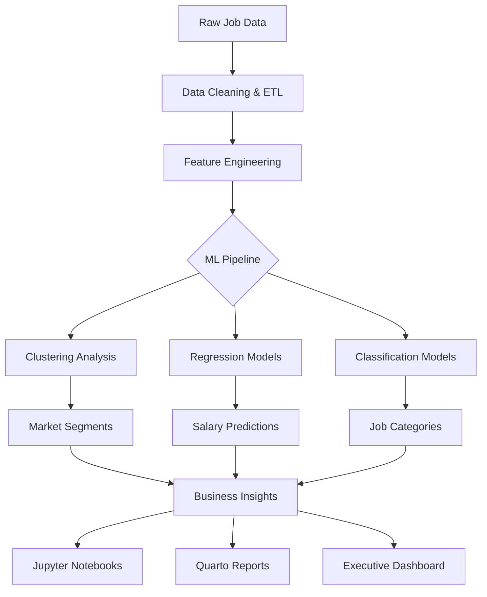
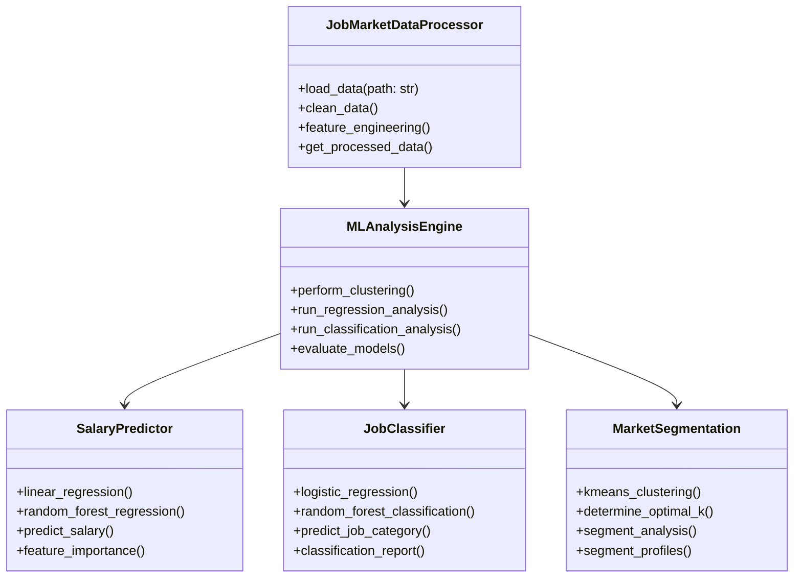

# Job Market Analytics Architecture

## Overview

This document outlines the hierarchical data analysis architecture for job market insights using machine learning approaches including regression, classification, and unsupervised learning techniques.

## Architecture Layers

### 1. Data Layer (`data/`)

```
data/
├── raw/                    # Original job market datasets
├── processed/             # Cleaned and transformed data
│   ├── clean_job_data.csv    # Primary analysis dataset
│   └── job_market_processed.parquet  # Optimized for large-scale processing
└── external/              # Reference datasets (ONET, SOC, NAICS classifications)
```

### 2. Processing Layer (`src/`)

```
src/
├── data/                  # Data processing and ETL
│   ├── enhanced_processor.py     # Main data processing pipeline
│   ├── spark_analyzer.py         # PySpark-based analysis engine  
│   └── preprocess_data.py        # Data cleaning utilities
├── analysis/              # ML and statistical analysis
│   ├── regression_models.py      # Salary prediction models
│   ├── classification_models.py  # Job categorization models
│   └── clustering_analysis.py    # Unsupervised learning
└── visualization/         # Plotting and reporting
    ├── plots.py                  # Statistical visualizations
    └── simple_plots.py           # Basic analysis charts
```

### 3. Exploration Layer (`notebooks/`)

```
notebooks/
└── job_market_skill_analysis.ipynb  # Interactive ML analysis notebook
```

### 4. Publication Layer (Quarto Website)

```
├── index.qmd                    # Executive summary
├── data-analysis.qmd            # Core analysis findings  
├── salary-analysis.qmd          # Compensation trends
├── regional-trends.qmd          # Geographic insights
└── remote-work.qmd             # Remote work analysis
```

## Machine Learning Pipeline

### Phase 1: Unsupervised Learning

**KMeans Clustering**

- **Purpose**: Market segmentation using job classifications
- **Features**: SOC codes, NAICS industry codes, ONET skill profiles
- **Output**: Job market segments for targeted analysis

### Phase 2: Regression Analysis  

**Salary Prediction Models**

- **Multiple Linear Regression**: Baseline salary modeling
- **Random Forest Regression**: Non-linear salary prediction
- **Target Variable**: `salary_avg` 
- **Features**: Location, experience level, industry, skills, education
- **Business Value**: Salary benchmarking and negotiation insights

### Phase 3: Classification Analysis


**Job Categorization Models**

- **Logistic Regression**: Binary classification (AI roles, remote-eligible)
- **Random Forest Classification**: Multi-class job category prediction
- **Target Variables**: Job title categories, SOC classifications, above-average pay flags
- **Business Value**: Career path recommendations and opportunity identification

## Key Analysis Components

### 1. Salary and Compensation Trends

```python
# Multiple Linear Regression Pipeline
Features: [location, job_title, skills_count, experience_years, industry]
Target: salary_avg
Models: Linear Regression, Random Forest
Metrics: R², RMSE, Feature Importance
```

### 2. Classification Analysis
```python
# Job Classification Pipeline  
Features: [job_description, skills, education, experience]
Targets: [above_average_salary, ai_role, remote_eligible]
Models: Logistic Regression, Random Forest
Metrics: Accuracy, Precision, Recall, F1-Score
```

### 3. Market Segmentation
```python
# Clustering Pipeline
Features: [soc_code, naics_code, skill_profile]
Algorithm: KMeans (k=5-8 segments)
Validation: Silhouette Score, Within-cluster SS
```

## Data Flow Architecture



## UML Class Architecture



## Business Impact Framework

### For Job Seekers
1. **Salary Optimization**: Predictive models for salary negotiation
2. **Career Pathways**: Classification models for career transitions
3. **Market Positioning**: Clustering insights for competitive advantage
4. **Geographic Strategy**: Location-based compensation analysis

### For Employers  
1. **Competitive Benchmarking**: Market-rate salary modeling
2. **Talent Acquisition**: Skill gap identification through clustering
3. **Role Classification**: Standardized job categorization
4. **Market Intelligence**: Trend analysis and forecasting

## Technical Requirements

### Dependencies

- **Core**: pandas, numpy, scikit-learn
- **Visualization**: matplotlib, seaborn, plotly
- **Big Data**: pyspark (for large datasets)  
- **Publishing**: quarto, jupyter

### Performance Considerations

- **Dataset Size**: 1,000+ job records
- **Model Training**: Cross-validation with 80/20 splits
- **Feature Selection**: Recursive feature elimination
- **Model Selection**: Grid search with 5-fold CV

### Quality Assurance

- **Data Validation**: Schema validation, outlier detection
- **Model Validation**: Hold-out test sets, performance monitoring
- **Documentation**: Automated model cards, analysis reports

## Implementation Priority

1. **Phase 1** (Foundation): Data processing pipeline and basic clustering
2. **Phase 2** (Core ML): Regression and classification model development  
3. **Phase 3** (Insights): Advanced feature engineering and model tuning
4. **Phase 4** (Publishing): Integration with Quarto reporting system

This architecture ensures scalable, maintainable, and business-focused machine learning analysis of job market data with clear separation of concerns and hierarchical organization.